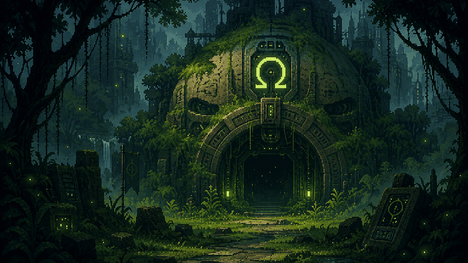
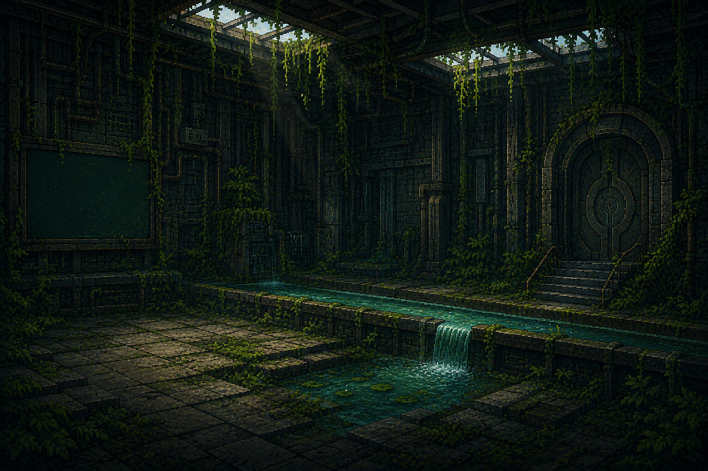
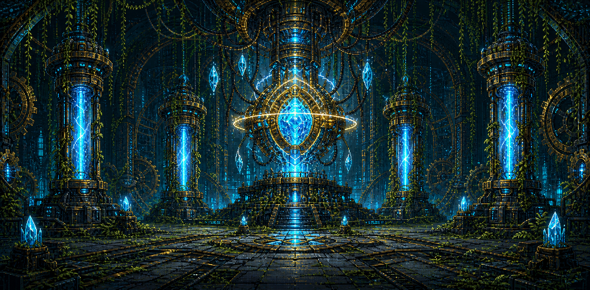

# NEXUS Ω: Guardianes de la Conservación


Videojuego educativo 2D hecho con `Next.js`, `React` y `TypeScript`, centrado en transformación de energía, ciencia y conservación.

El proyecto combina:
- aventura narrativa por niveles,
- actividades interactivas educativas,
- progreso local del jugador,
- tabla de puntuación con Firebase,
- soporte PWA para experiencia tipo app,
- logros locales con notificaciones estilo juego.

## Vista rápida



## Demo del juego

- Menú principal con nueva partida, continuar y tabla de puntuación.
- 6 niveles temáticos con narrativa y actividades.
- Sistema de score, rachas, bonus y resumen final por nivel.
- Logros persistidos en `localStorage`.
- Experiencia mobile optimizada para dispositivos reales.

## Screenshots

### Menú principal


### Nivel 1 — Laboratorio del Movimiento



### Nivel final — Núcleo de Conservación



## Cómo jugar

1. Presiona `Nuevo Juego`.
2. Escribe el nombre del jugador.
3. Mira la introducción narrativa.
4. Toca o haz clic en los objetos interactivos desbloqueados.
5. Resuelve cada actividad para restaurar el sector.
6. Revisa el resumen del nivel y sigue al siguiente.

### Controles

- `Click / tap` para interactuar con escenario y diálogos
- `Arrastrar`, `seleccionar` o `mover slider` según la actividad
- `Control de volumen` en la esquina superior
- `Salir` para volver al menú principal

### Consejos

- En mobile, úsalo en horizontal.
- En Android web, instala la PWA para mejor experiencia.
- Si no configuras Firebase, puedes jugar normalmente con guardado local.

## Stack

- `Next.js 16`
- `React 19`
- `TypeScript`
- `Tailwind CSS 4`
- `Framer Motion`
- `Firebase / Firestore`
- `narraleaf-react`

## Características

- Campaña educativa de `6 niveles`
- Sistema de actividades con múltiples tipos de interacción
- Score acumulado, bonus, rachas y actividades perfectas
- Logros locales con notificaciones en pantalla
- Leaderboard online con Firebase
- Guardado local para continuar partida
- PWA instalable en Android
- Ajustes específicos para mobile real

## Requisitos

- `Node.js 20+`
- `npm 10+` o `bun`

## Instalación

```bash
npm install
```

o con Bun:

```bash
bun install
```

## Variables de entorno

Crea un archivo `.env.local` usando `.env.example` como base.

Si no configuras Firebase, el juego seguirá funcionando, pero:
- no podrá crear jugadores en la tabla,
- no podrá sincronizar progreso online,
- no podrá cargar leaderboard real.

## Desarrollo local

```bash
npm run dev
```

Abre `http://localhost:3000`.

## Scripts

- `npm run dev` — entorno local
- `npm run build` — build de producción
- `npm run start` — servir build
- `npm run lint` — revisar lint

## Estructura del proyecto

```text
app/                    Rutas App Router, layout global, PWA y pantallas
activities/             Configuración de actividades por nivel
components/             UI, narrativa, escena, menú, actividades y logros
hooks/                  Estado del juego, audio, métricas, leaderboard, guardado
levels/                 Configuración de los 6 niveles
lib/                    Firebase, scoring y utilidades base
services/               Acceso a leaderboard, jugadores, progreso, niveles y actividades
types/                  Tipos del dominio
public/                 Assets, iconos, fondos, sprites y manifest resources
```

## Arquitectura resumida

- `app/page.tsx` carga el menú principal.
- `app/game/level-x/page.tsx` abre cada nivel.
- `components/game/SceneEngine/SceneEngine.tsx` coordina exploración, actividades y diálogos.
- `hooks/useSceneEngine.ts` controla la máquina de estados del nivel.
- `app/game/_components/LevelPageClient.tsx` calcula score, resumen y transición entre niveles.
- `components/game/Achievements/AchievementProvider.tsx` administra logros locales y toasts.
- `services/player.service.ts`, `services/progress.service.ts` y `services/leaderboard.service.ts` conectan Firebase.

Más detalle en `docs/ARCHITECTURE.md`.


## Flujo del juego

1. El jugador inicia partida desde el menú.
2. Se registra un nombre y se crea el jugador en Firestore si Firebase está configurado.
3. Se reproduce la historia inicial.
4. Cada nivel desbloquea objetos interactivos en secuencia.
5. Cada actividad devuelve métricas de desempeño.
6. El sistema calcula score, rachas, bonus y progreso acumulado.
7. Al completar el nivel se muestra un resumen y se sincroniza el progreso.

## Flujo del usuario

```text
Menú principal
  -> Nuevo Juego
  -> Nombre del jugador
  -> Historia inicial
  -> Nivel 1
  -> Actividades y progreso
  -> Resumen de nivel
  -> Siguiente nivel
  -> ...
  -> Nivel final
  -> Cierre de campaña

Menú principal
  -> Continuar
  -> Último nivel guardado

Menú principal
  -> Tabla de puntuación
  -> Consulta del leaderboard
```

## Persistencia

### Local

Se guarda en `localStorage`:

- progreso principal de la partida,
- score acumulado,
- rachas,
- actividades perfectas,
- logros desbloqueados.

### Online

Si Firebase está disponible:

- se crea el jugador en la colección `leaderboard`,
- se sincroniza score y progreso por nivel,
- se consulta la tabla de puntuación.

## Mobile y PWA

- La app está preparada como PWA.
- En Android web se muestran sugerencias para instalar la app.
- En modo standalone se avisa cuando el dispositivo está en vertical.
- La detección mobile usa dispositivo real, no solo tamaño de pantalla.

## Capturas y material visual

Por ahora el README reutiliza fondos reales del proyecto almacenados en `public/backgrounds/`.  


## Logros

El sistema de logros:

- vive en el cliente,
- persiste en `localStorage`,
- muestra toasts visuales al desbloquear hitos relevantes,
- evita duplicados en unlock y en cola visual.

## Accesibilidad y UX

- Navegación visual clara tipo videojuego.
- Feedback contextual al interactuar con objetos.
- Loader entre niveles.
- Resumen final por nivel.
- Control de volumen de música integrado.

## Deploy

Antes de desplegar:

1. configura variables `NEXT_PUBLIC_FIREBASE_*` si usarás leaderboard,
2. ejecuta:

```bash
npm run build
```

3. despliega en la plataforma de tu preferencia.

## Documentación adicional

- `docs/ARCHITECTURE.md`
- `CONTRIBUTING.md`
- `.env.example`

## Estado actual

El proyecto ya incluye:

- 6 niveles jugables,
- actividades múltiples por nivel,
- leaderboard con Firebase,
- soporte PWA,
- mejoras mobile,
- sistema de logros local.

## Contribución

Si vas a colaborar, revisa primero `CONTRIBUTING.md`.

